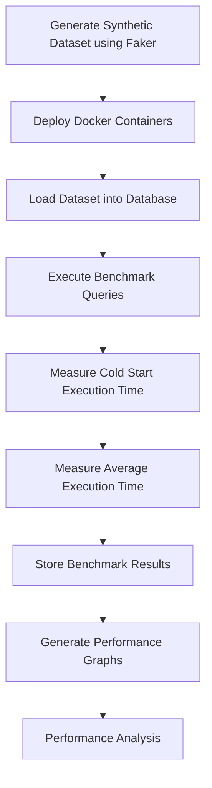

# 📊 Database Performance Benchmarking across SQL and NoSQL Database Systems


---

# 📖 Overview

This project presents a comprehensive comparative benchmarking study of **SQL and NoSQL database management systems** using a Dockerized experimental environment and synthetic large-scale datasets.

Five widely adopted database technologies were evaluated under identical workloads:

- **MySQL** (Relational Database)
- **MongoDB** (Document Database)
- **Redis** (In-Memory Key-Value Store)
- **Neo4j** (Graph Database)
- **Apache Cassandra** (Wide-Column Database)

A synthetic **Course Management System (CMS)** dataset containing up to **1 million records** was generated using Python's **Faker** library and deployed across isolated Docker containers. Each database was benchmarked using standardized queries executed over multiple dataset sizes to evaluate scalability, query execution performance, and database suitability for different application scenarios.

The project demonstrates practical applications of **database engineering**, **performance benchmarking**, **Docker containerization**, **Python automation**, and **large-scale data analysis**.

---

# 🎯 Objectives

- Compare the performance of SQL and NoSQL databases.
- Evaluate scalability across increasing dataset sizes.
- Measure cold-start and average query execution times.
- Analyze how different database architectures perform under identical workloads.
- Demonstrate reproducible benchmarking using Dockerized environments.
- Identify strengths and limitations of each database technology.

---

# 🏗 Technology Stack

| Category | Technologies |
|-----------|--------------|
| Programming Language | Python |
| Containerization | Docker, Docker Compose |
| Dataset Generation | Faker |
| Relational Database | MySQL |
| Document Database | MongoDB |
| Graph Database | Neo4j |
| Key-Value Database | Redis |
| Wide-Column Database | Apache Cassandra |
| Data Analysis | Pandas, NumPy |
| Result Visualization | Microsoft Excel |

---

# 🗄 Databases Evaluated

| Database | Type | Primary Strength |
|-----------|------|------------------|
| MySQL | Relational | ACID transactions and SQL querying |
| MongoDB | Document | Flexible schema and horizontal scalability |
| Redis | Key-Value | Ultra-fast in-memory data access |
| Neo4j | Graph | Efficient relationship traversal |
| Apache Cassandra | Wide-Column | Distributed storage and high scalability |

---

# 🔄 Benchmark Workflow



---

# ⚙ Experimental Setup

The benchmark was conducted under identical experimental conditions to ensure fairness across all database systems.

### Dataset Sizes

- 250,000 Records
- 500,000 Records
- 750,000 Records
- 1,000,000 Records

### Benchmark Methodology

- Synthetic Course Management System dataset
- Dockerized isolated environments
- Identical schema representation across databases
- Four benchmark queries with increasing complexity
- Each query executed **31 times**
- First execution recorded as **Cold Start**
- Remaining executions averaged to determine steady-state performance
- Database reset between experiments to eliminate caching effects

---

# 📊 Benchmark Queries

### Query 1

Retrieve students enrolled in a specific course.

### Query 2

Retrieve students who submitted assignments while enrolled in a selected course.

### Query 3

Update assignment status and retrieve the updated records.

### Query 4

Retrieve students satisfying assignment submission status and score constraints.

---

# ✨ Key Features

- Comparative benchmarking of five database technologies
- SQL vs NoSQL performance evaluation
- Docker-based reproducible experimental environment
- Automated benchmark execution using Python
- Synthetic dataset generation with Faker
- Cold-start and average execution time analysis
- Performance comparison across multiple dataset sizes
- Scalability evaluation
- Result visualization and comparative analysis

---

# 📂 Repository Structure

```text
Database-Performance-Benchmarking/

│
├── datasets/
│   └── README.md
│
├── scripts/
│   ├── mysql/
│   ├── mongodb/
│   ├── cassandra/
│   ├── redis/
│   └── neo4j/
│
├── benchmark_results/
│   ├── mysql_query_execution_times.xlsx
│   ├── mongodb_query_execution_times.xlsx
│   ├── cassandra_query_execution_times.xlsx
│   ├── redis_query_execution_times.xlsx
│   ├── neo4j_query_execution_times.xlsx
│   └── Graphs.xlsx
│
├── data-generation/
│   └── faker_code_1mil.py
│
├── Dockerfile
├── docker-compose.yml
├── requirements.txt
├── LICENSE
├── .gitignore
└── README.md
```

---

# 📈 Results

The benchmarking process generated detailed execution-time measurements for each database under different workloads.

The repository includes:

- Query execution time comparisons
- Cold-start performance measurements
- Average execution time analysis
- Scalability comparisons
- Performance graphs
- Experimental observations

Benchmark results can be found in the **benchmark_results/** directory.

---

# 🚀 Future Improvements

- Benchmark additional database systems such as PostgreSQL and Elasticsearch.
- Evaluate distributed multi-node database clusters.
- Benchmark datasets larger than 10 million records.
- Integrate interactive dashboards using Plotly or Power BI.
- Deploy benchmarks on cloud infrastructure.
- Automate benchmark execution through CI/CD pipelines.

---

# 📚 Learning Outcomes

Through this project, I gained practical experience in:

- SQL and NoSQL database architectures
- Database performance benchmarking
- Docker containerization
- Python automation
- Large-scale synthetic data generation
- Performance analysis and visualization
- Experimental design and reproducible research methodologies

---

# 🙏 Acknowledgements

This project was developed as part of the **Database Systems** coursework at the **University of Messina**. It investigates the performance characteristics of relational and NoSQL database systems through reproducible benchmarking experiments using Docker, Python automation, and large-scale synthetic datasets.

---

# 📄 License

This project is licensed under the **MIT License**.

---

> **Note**
>
> The large synthetic datasets used for benchmarking are not included in this repository due to their size. The repository contains the benchmarking scripts, Docker configuration, experimental results, and documentation required to reproduce the study.
